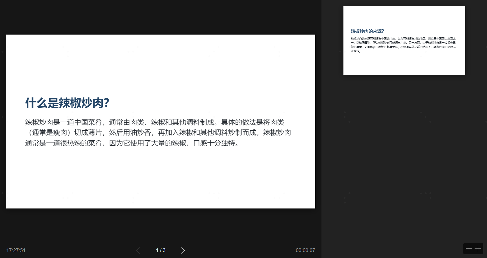

# chat-gpt-ppt

use ChatGPT to generate PPT automatically

## Show case

Some topics for presentation named `topics.txt`:

```
what's OpenAI?
how OpenAI works?
what is the future of OpenAI?
```

Easily generate a simple ppt in seconds:

```
cgp token.txt topics.txt
```

And you get a slice:

```
[  INFO ] Converting 1 markdown...
[  INFO ] C:\Users\ADMINI~1\AppData\Local\Temp\tmpt202812s => output.html
2022-12-05 16:08:24.154 | INFO     | cgp:main:82 - result saved to output.html
```


And multi languages:



## Usage

### Install lib

```python
pip3 install chat_gpt_ppt
```

### Get your session token

https://github.com/acheong08/ChatGPT#get-your-session-token

### Install marp

Currently we use [marp](https://github.com/marp-team/marp-cli/releases/tag/v2.2.2) as our ppt renderer.
You can easily download it via the link above.

### Run

```
cgp token.txt data.txt --marp_exe /your/marp/exe/path
```

## Contribution

This is a toy project.
Feel free to hack. Only < 100 lines python code.

## License

MIT
